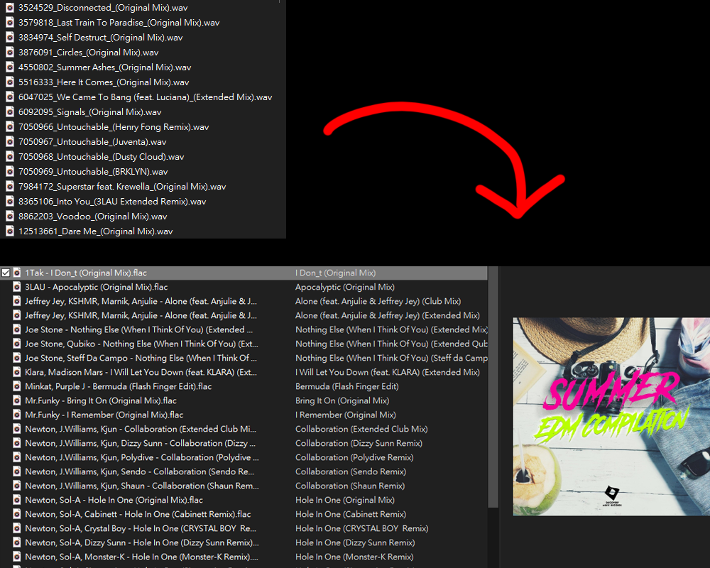

# Beatport Tagger
Convert wav files downloaded from beatport to flac and add tags.  
  

## Usage
- Download `beatport-tagger.exe` from [releases](https://github.com/rogeraabbccdd/beatport-tagger/releases)
- Install [ffmpeg](https://www.ffmpeg.org/), and has setted it in environment variable `PATH`
- Drag folder with beatport wav files to `beatport-tagger.exe`
- Conveted files are located inside `output` folder.

## Build
- Clone the repo.
- Install [Yarn](https://yarnpkg.com/).
- Run `yarn` to install dependencies.
- Run `yarn build` to build executable.
